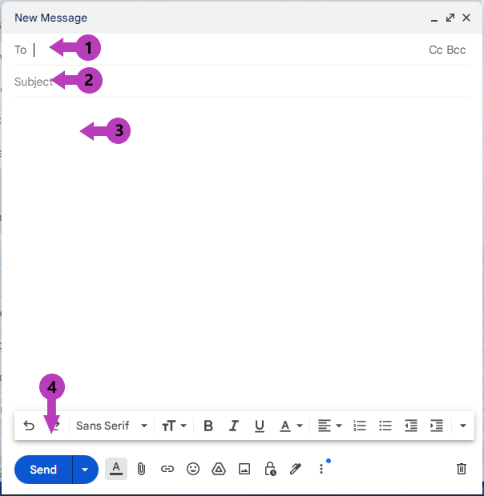
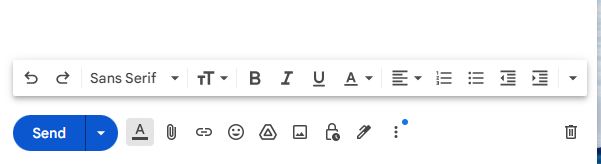
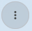

# How to Send an Email on Gmail

This guide will help you quickly access the essential information on how to send an email using Gmail.

## Step 1: Access Gmail

1. **Go to Gmail:**
   - Open your web browser and go to [Gmail](https://www.gmail.com).
2. **Log in to Your Account:**
   - Enter your email address and password.
   - If you don’t have a Gmail account, follow the instructions below to [create one](CreateAccount.md).

## Step 2: Create an Email

1. **Open a new email:**
   - Click on the **Compose** button in the upper left corner. An email window will pop up in the lower right corner of your screen.
2. **Write your email:**
   - **Recipient's Email Address:** In the **To (1)** field, type the email address of the person you want to send the email to. You can send the email to multiple people by separating the email addresses with commas.
   - **Subject:** In the **Subject (2)** field, type a brief description of what your email is about.
   - **Message:** In the large **text box (3)** below the subject, type your message.
3. **Send Your Email:**
   - When you have finished writing your email, click on the **Send (4)** button at the bottom of the email window.

## Step 3: Reply or Forward an Email

1. **Go to your Inbox:**
   - Click on **Inbox** in the left panel to see your received emails.
2. **Open the email:**
   - Click on the email you want to reply to or forward.
3. **Reply or Forward:**
   - To reply, click on the **Reply** button at the bottom of the email.
   - To forward, click on the **Forward** button.

**Tip:** Use **Cc** next to the email address section to add another recipient. Use **Bcc** to send a copy of the email without informing the recipients in the **To** or **Cc** fields. The email addresses in the Bcc field will not appear in the received message header.
## Step 4: Attachments

1. **Add an attachment:**
   - To add an attachment, click on the  and select a file from your device.
2. **Other options to include in your email:**
   -  Insert link
   -  Insert emoji
   -  Insert file using Google Drive
   -  Insert photo

## Step 5: Format your Email

1. **Change Text Style:**
   - This section allows you to select the font and size of a text. You can make a text bold, italic, underlined, or change the color.
   - Click on  at the bottom of your email to access formatting options.
   - Select a part of the text you want to format and click on the appropriate icon.

        

## Step 6: Mark an Email

1. **Find Important Emails:**
   - Select the email you want to mark, click on  and select **Mark as important** or **Add star**.
2. **Access Marked Emails:**
   - Click on **Important** or **Starred** in the left panel to find marked emails quickly.

## Step 7: Access Sent Emails

1. **View Sent Emails:**
   - Click on **Sent** in the left panel to see emails you have sent.

**Tip:** Check the **Sent** folder before you close the browser or disconnect from the Internet on your device.
